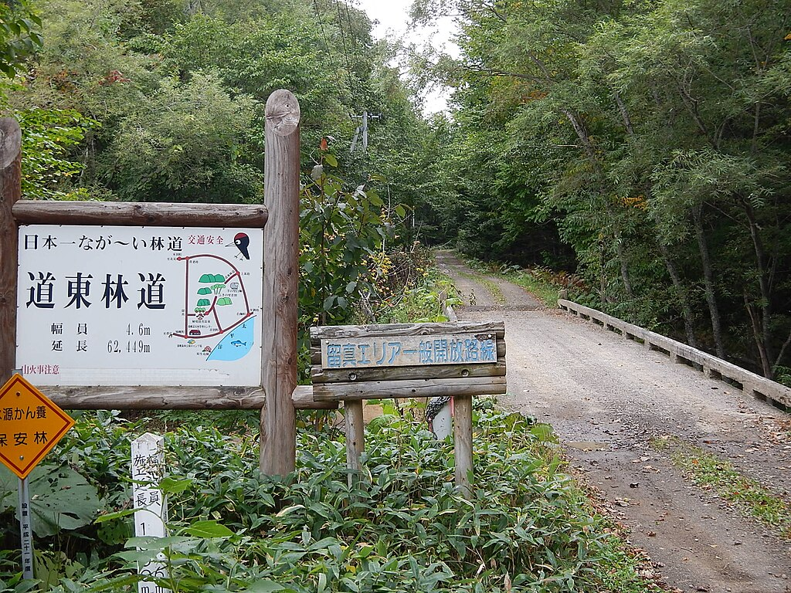

# map_app# 🌦 地域×情報マップ（Urahoro × Kamoenai）

## 🗾 概要
北海道の地域情報と天気を地図上で可視化するWebアプリです。  
Google Maps APIとOpenWeatherMap APIを連携し、各地域の位置と現在の天気を直感的に確認できます。  
現在は「浦幌町」と「神恵内村」をマッピングし、それぞれの画像・天気アイコン・説明を表示しています。

## 🧩 使用技術
- **HTML / CSS / JavaScript**
- **Google Maps JavaScript API**
- **OpenWeatherMap API**

## 🗺️ 主な機能
- Googleマップ上に「浦幌町」「神恵内村」のピンを表示  
- 各地域の現在の天気とアイコンをリアルタイム表示  
- ピンをクリックすると、画像・説明・天気が吹き出しで表示される  
- シンプルで見やすいUI（スマホでも閲覧可）

## 💻 開発の背景
地方創生や移住支援に関心があり、  
「地図を通して地域の魅力や生活情報を伝えたい」という想いから開発しました。  
天気情報を組み合わせることで、地域の“今”を感じられる構成を目指しました。

## 🚀 今後の展望
- JSONデータ化して複数地域を自動表示  
- 天気予報や気温推移などの追加  
- UIの改善（カード型リストなど）  
- React版・Next.js版への発展  

## 🪄 デモサイト
👉 [https://mei-oku.github.io/map_app/](https://mei-oku.github.io/map_app/)

## 📁 ファイル構成
map_app/
├── index.html
├── style.css
├── script.js
├── urahoro.jpg
└── kamoenai.jpg

markdown
コードをコピーする

## 🧠 学んだこと
- Google Maps API と OpenWeatherMap API の連携  
- fetch関数による非同期データ取得  
- 吹き出し（InfoWindow）のカスタム構成  
- GitHub Pagesを使ったデプロイ手順  

## ✨ 作者
**谷口 輝（MEI-OKU）**  
- GitHub: [@MEI-OKU](https://github.com/MEI-OKU)  
- 興味分野: 地方創生・移住支援・サテライトオフィス・Web開発